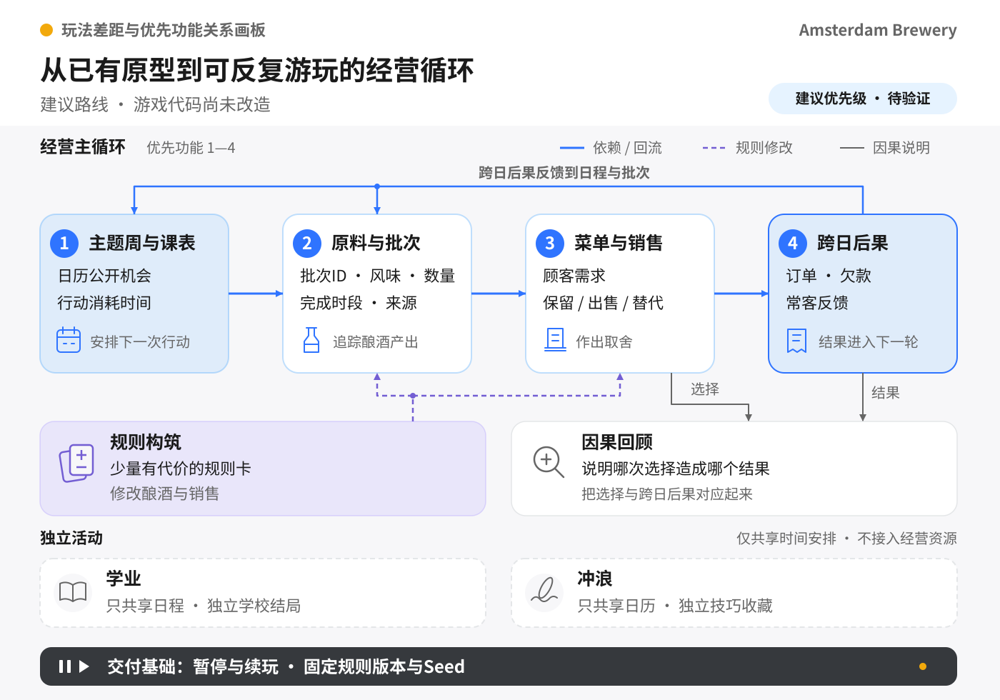

# Amsterdam Brewery 玩法差距与高价值功能调研

> 本文为调研归档，不代表功能已经实现。代码盘点基线为 `12995e2d6c47691795cde18864f9a13fa21cf887`；[飞书协作版](https://bytedance.larkoffice.com/docx/Bg8ddVmAKohUIFxVKX3codBBnCc)。

> 项目已积累地图、酿酒、服务、冲浪、关系和局外成长等原型资产，下一阶段最值得投入的是让城市日历、玩家选择和经营结果形成可理解的连续因果。差异化机会在于：玩家作为阿姆斯特丹的学生，在课程和节庆之间安排有限时间，做出带有来历与缺陷的酒，并经营逐渐记住自己的顾客。建议优先打通主题周、批次、销售反馈与跨日承诺，再验证少量规则构筑；现有二十二份策划应作为候选库，不能等同于已完成实现或必须全部开发的范围。

## 一、结论适用哪个版本

本轮核对日期为 2026 年 9 月 14 日。实时读取 GitHub 的 HEAD 和全部分支头后，默认分支仍指向 `funify-v3/amsterdam-map-refine` 的 `12995e2d6c47691795cde18864f9a13fa21cf887`，本地工作区干净。以下实现结论仅针对该快照；用户在其他云端环境的未推送修改不在可见范围。因此不能把“此快照未实现”推断成“其他环境也没做”。（来源：[代码快照](https://github.com/peterhuang-coding/amsterdam-brewery-unity/blob/12995e2d6c47691795cde18864f9a13fa21cf887/tools/prototype/index.html)）

本报告用三种口径区分证据：代码直接读到的功能行为；官方对竞品功能的自述；基于二者提出的设计判断。没有亲自试玩本轮版本，不宣称已经证明哪个机制更好玩，也不把历史文档中的测试通过数字视为本轮运行结果。策划基准是本会话已确认的日程、经营、学业和冲浪边界，以及现有小游戏设计合集。[小游戏设计合集](https://bytedance.larkoffice.com/docx/OOL9dJdJyojff1xzVXuclgKin8d)

## 二、二十二项玩法：已有资产与真正缺口

“已有”表示读到了对应实现，不代表体验已经过关；“关闭”表示实现代码存在，但当前正常入口被 MVP 门禁拦住；“缺失”表示未找到满足策划语义的实现。代码在 `enterBldg()` 明确关闭 market、station、academic、dive、shroom，不能用函数存在证明玩家能玩到。以下表格为静态功能盘点。（来源：[入口与玩法代码](https://github.com/peterhuang-coding/amsterdam-brewery-unity/blob/12995e2d6c47691795cde18864f9a13fa21cf887/tools/prototype/index.html#L3821)）

| 玩法 | 当前状态 | 与策划的实际差距 |
| --- | --- | --- |
| 01 七日计划与每日排程 | 时间轴与日志已有；计划系统缺失 | 七天、六时段、每日目标和事件已有；未见预生成活动日历、课表、预约与行动预算。 |
| 02 城市路线与通勤 | 地图移动已有；通勤入口关闭 | 已有桥梁改道、地图缩放和车站选择，尚未构成时间、票价与活动封路的路线策略。 |
| 03 合法采购与议价 | 目标机制缺失 | 酿酒中选原料是切换配方索引；没有持续消耗的原料购物篮。当前 market 指向偷窃。 |
| 04 逃票 | 三阶段雏形；正常车站入口关闭 | 已有技巧、失败和教师关系；未接统一证据、货物来源与未来事件变化。 |
| 05 超市偷窃 | 市场偷货雏形；入口关闭 | 现为三个摊位红绿灯按键，成功直接加钱；尚无目标物品与背包取舍。 |
| 06 黑市销赃与洗白 | 目标机制缺失 | hotGoods 有记录，但偷货已经兑现；尚无独立买家、等待报价、处理来源的闭环。 |
| 07 追捕与逃脱 | 局部逃脱可复用 | 尚非全城统一的风险结算器，缺跨行为证据与资源牺牲选择。 |
| 08 酿酒 | 已有完整操作雏形 | 六种酒、选料、温控、三段时机、事件和笔记已有；结果仍直接加现金，未生成完整批次。 |
| 09 发酵照料与抢救 | 局内阶段与事故已有 | “Ferment”是短计时阶段；缺跨日成熟、延迟出货与有代价的救酒决策。 |
| 10 地窖库存与分配 | 三类库存计数已有 | 库存未保存单批品质、风味、来源、完成时间；不能按批次保留、混合或交付订单。 |
| 11 菜单定价与备货 | 推荐、饮品目录、议价已有 | 缺从真实批次备货的班前菜单、供货承诺和有限补货。 |
| 12 晚间酒吧服务 | 已有 | 有顾客原型、耐心、报价、倒酒和关系；主要缺口是读取批次差异与让库存约束真正生效。 |
| 13 深夜盘点与债务 | 跨日重置和未营业罚款已有 | 缺现金流预测、付账排序、延期代价与债务期限。 |
| 14 Coffeeshop 订单 | 已有较多内容 | 产品、顾客、热度、地下交易和豆库存已有；应明确与酒吧的职责差异，避免继续做平行刷钱入口。 |
| 15 SmartShop 标签合成 | 培养与配方资产已有；入口关闭 | 现有培养、品质和跨游戏配方未形成“有明确结果范围的批次突变”；部分关联违背新边界。 |
| 16 设备维修 | 升级资产可复用；维修玩法缺失 | 缺稳定的故障诊断、临时维修与取舍，暂可做事件选项。 |
| 17 日常上课、作业、出勤 | 目标机制缺失 | 现为论文投稿小游戏，无工作日课表、出勤及作业期限。 |
| 18 关键学业挑战 | 论文小游戏已有；入口关闭 | 现有选题、分数、投稿和申诉可作为资产；与学生考试/展示的时间冲突及独立结局不同。 |
| 19 NPC 谈判与承诺 | 对话、好感与派系已有 | 对话给钱、送礼升级可用；缺明确的交付对象、期限、替代条件与失信后果。 |
| 20 冲浪 | 操作已有；边界尚未调整 | 有浪区、动作、落水、收藏；finSurf 仍给全局钱和 Meta，并设置咖啡加成，文案仍是信息/科研冲浪。 |
| 21 节庆摊位 | 目标机制缺失 | 国王节等收益事件已有，未见场地容量、携带库存、客流波次与收摊决策。 |
| 22 第七天终局 | 评级与总结已有 | 已有目标评级、金钱、派系、遗产和总结卡；缺批次品质、供货与来源的啤酒节评审。 |

盘点对应 `startBrew/finBrew`、`startShoplift/finShoplift`、`finSurf`、`startAcad/acadIn`、`barIn/finBar`、`advanceTimeAuto` 和 `endGame` 的数据读写，而不依赖 BACKLOG 的勾选状态。（来源：[小游戏与结算实现](https://github.com/peterhuang-coding/amsterdam-brewery-unity/blob/12995e2d6c47691795cde18864f9a13fa21cf887/tools/prototype/index.html#L3862)）

## 三、最影响乐趣的六个未闭合环节

### 1. 批次有生产结果，但没有持续身份

`finBrew()` 同时增加现金、记录配方最佳星级，并给 `G.barStock` 三类计数加一。之前“酿酒和酒吧完全没连起来”的说法不够准确：数量供货已经连接，但生产出的品质与来历没有跟着这一份库存进入顾客选择。建议先把这条弱连接升级为真实批次流。（来源：[酿酒结果与供货](https://github.com/peterhuang-coding/amsterdam-brewery-unity/blob/12995e2d6c47691795cde18864f9a13fa21cf887/tools/prototype/index.html#L3938)）

### 2. 供货不足尚不足以改变经营策略

`barIn()` 有库存时扣一，没有库存时仍以 house brand 完成交易，只将结果乘以 0.5。这是一种容错设计，但在当前规则下会削弱“为什么我要采购和酿酒”的动机。建议保留可购买、数量有限的基础酒作为救急，同时让自酿批次决定高价值订单、常客偏好与终局资格。（来源：[酒吧库存与替代酒](https://github.com/peterhuang-coding/amsterdam-brewery-unity/blob/12995e2d6c47691795cde18864f9a13fa21cf887/tools/prototype/index.html#L5257)）

### 3. 时间推进存在，生活承诺还不存在

当前 `bldgPhaseOk()` 按时段数字开放建筑，`addSch()` 记录已做活动，`advanceTimeAuto()` 推进日期。还没有统一的“进入一个动作会消耗哪段时间，以及因此放弃什么”的合同。日历如果仅增加一排节日图标，不会产生策划期望的生活取舍。（来源：[时段门禁](https://github.com/peterhuang-coding/amsterdam-brewery-unity/blob/12995e2d6c47691795cde18864f9a13fa21cf887/tools/prototype/index.html#L3823)）

### 4. 失败主要影响数字，较少打开新路线

当前酿酒失败会清订单并退出，成功路径要求配方索引匹配；偷货成功则立即获得现金。建议把可食用但偏离目标的酒转成真实风味变化，让玩家在清仓、改配、延期与订单用途之间选择。食品不安全的污染酒应报废或安全回收，不能和“味道不符合预期”混为一谈。（来源：[酿酒失败路径](https://github.com/peterhuang-coding/amsterdam-brewery-unity/blob/12995e2d6c47691795cde18864f9a13fa21cf887/tools/prototype/index.html#L3905)）

### 5. 同一 Seed 目前不等于同一挑战

分享链接只包含 Seed，但事件抽取还读取 Run 次数、历史事件和升级条件。回放保存的是行动日志，不能等同完整状态恢复。若未来做每日挑战，需要固定规则版本和起始配置，并把世界随机与玩家局外成长分离；完整操作级复现还需要控制随机流与输入时间。（来源：[Seed 与事件生成](https://github.com/peterhuang-coding/amsterdam-brewery-unity/blob/12995e2d6c47691795cde18864f9a13fa21cf887/tools/prototype/index.html#L3666)）

### 6. 存档资产已有，整局续玩合同需要补齐

`saveMeta` 保存升级、Meta、历史等，`saveLedger` 保存长期笔记，`saveReplay` 保存日志；这些不能单独恢复当前日期、待售批次、到期承诺和游戏中的全部状态。完整续玩与暂停是低调但高价值的功能：七日局需要允许玩家中断。先支持时段结束自动保存即可，不必首版恢复每一帧小游戏。（来源：[现有持久化](https://github.com/peterhuang-coding/amsterdam-brewery-unity/blob/12995e2d6c47691795cde18864f9a13fa21cf887/tools/prototype/index.html#L2716)）

## 四、竞品已经做了什么，我们应避开哪些重复

以下是机制参照，不是销量排行榜，也不是宣称七款游戏属于同一严格品类。官方功能说明是自述口径；除特别说明外，尚未逐项获得三个独立域名的交叉验证，不标成“全面独立核实”。

| 产品 | 已公开的机制 | 对本项目的启示 |
| --- | --- | --- |
| Ale Abbey | 酿酒特性试验、品质/产量/温度、陈化或出售、修道院人员经营。 | 是最值得正面对照的酿酒经营参照；仅加批次、陈化和命名还不构成独家卖点。 |
| Brewmaster | 真实酿造化学、配方试验、标签品牌、比赛、沙盒与配方分享。 | 配方真实性和酒标定制已有强参照；本项目宜突出城市生活压力与短局选择。 |
| Travellers Rest | 酒馆经营、制作、种植、配方、世界探索和装修。 | 泛生活经营内容很丰富；本项目可突出可复玩的主题周、紧凑日程和具体顾客承诺。 |
| Dave the Diver | 白天采集与探索、晚上菜单和餐厅，收益反哺装备，并有大量支线。 | 日夜经营循环和小游戏集合本身不稀缺；核心是两段玩法互相提供目标与回报。 |
| PlateUp! | 程序生成餐厅、设备布置与自动化、十五天经营与 Franchise 进程。 | 随机经营需要能改变操作方式的构筑；只增加收益乘数不足以制造不同玩法。 |
| Citizen Sleeper | 骰子、时钟、有限日常行动、关系与相互竞争的生存目标。 | 生活冲突可以靠有限行动和明确期限成立，不要求每件事都有独立操作小游戏。 |
| Potion Craft | 可探索的炼金地图、组合效果、客户用途、原料购买和商品定制。 | 让制作过程可读，让同一产物因客户目的而有不同价值；避免只有一条正确配方。 |

Ale Abbey 商店全文明确包含命名、特性、品质/数量与陈化交易；Brewmaster 官网明确包含配方试验、标签与比赛。二者提供具体重叠机制，支持“酿酒题材本身不足以差异化”的判断。（来源：[Ale Abbey 官方商店说明](https://store.steampowered.com/app/2789460/)） （来源：[Brewmaster 官网](https://www.aurochdigital.com/brewmaster)）

Travellers Rest 官方商店展示酒馆、制作与探索；Dave 官方商店明确介绍白天潜水、晚上餐厅和资源回流。（来源：[Travellers Rest 官方商店说明](https://store.steampowered.com/app/1139980/)） （来源：[Dave the Diver 官方商店说明](https://store.steampowered.com/app/1868140/)）

PlateUp! 的设备布局、程序生成条件和十五天挑战来自官方商店；Citizen Sleeper 的有限骰子行动与时钟来自发行商官网。（来源：[PlateUp! 官方商店说明](https://store.steampowered.com/app/1599600/)） （来源：[Citizen Sleeper 发行商介绍](https://www.fellowtraveller.games/citizen-sleeper)）

Potion Craft 的不同配方路径、顾客目的和产品定制来自官方商店。作为跨产品设计判断，可以把上述参照归纳为三种价值来源：生产与销售互相驱动、每局构筑改变处理问题的方法、时间与关系承诺让取舍有重量。（来源：[Potion Craft 官方商店说明](https://store.steampowered.com/app/1210320/)）

### 玩家反馈为什么要求我们收缩小游戏数量

本轮定向抽取 Travellers Rest 最新五条英文负评与五条英文正评，覆盖 2026 年 9 月 6—14 日。负评样本中，玩家提到强制支线小游戏、跑图采集与其他活动挤占酒馆经营；正评样本则有人喜欢制作组合、持续任务循环和装饰，也有人仍感到上手信息不足。样本很小，而且主动选了正负各五条，不能推断整体负评率或“多数玩家怎么想”。（来源：[负评样本：支线挤占酒馆时间](https://steamcommunity.com/profiles/76561198136214917/recommended/1139980/)） （来源：[正评样本：组合玩法与上手负担](https://steamcommunity.com/profiles/76561198334404409/recommended/1139980/)）

反例也要保留：PC Gamer 的 Dave 评测高度认可持续加入新机制，认为它们带来惊喜，并明确描述餐厅需求如何反过来引导第二天采集。该评测发表于 2023 年，可能已过时，仅用于理解当时的设计结构，不用于评价 2026 年版本。由这组证据得到的建议是“控制支线占时与入口方式”，而不是“一律少做内容”。（来源：[PC Gamer：Dave the Diver 评测](https://www.pcgamer.com/dave-the-diver-review/)）

## 五、什么才是本项目可建立的差异

建议定位假设：**在阿姆斯特丹读书兼顾小酒馆的一周经营肉鸽；玩家提前看到城市机会，在有限课余时间中做准备，让每批酒和每次承诺改变之后的生活。**目标玩家优先是假设中的“喜欢短局计划、制作组合、经营反馈和城市生活故事”的单人玩家，是否愿意购买仍需试玩与商店表达验证。

差异来自组合关系，而非宣称某个单机制市场独有：

| 候选差异 | 玩家实际会感到什么 | 成立条件 |
| --- | --- | --- |
| 有身份约束的城市主题周 | 同一张城市地图，每周要安排的事情不同；上课、采购、营业不能全做。 | 日程消耗与行动门禁生效；普通义务自动简化，不能只是强迫等待。 |
| 带来历的批次 | 记住“那桶因为赶活动而改配的酒”，不同顾客对它有不同反应。 | 同一个批次 ID 从材料延续到菜单、订单和回顾。 |
| 小范围、可理解的城市后果 | 失约、赊账、灰色获取会改变下次机会，而非只扣一条数值。 | 后果有预告、延迟和解决路径；限定在相应系统内。 |
| 经营与个人生活并列 | 经营之外可以冲浪；学生成绩和个人收藏有自己的意义。 | 不把冲浪变成经营必刷资源；学业和冲浪分别结算。 |

### 节庆日历需要可信的约束

I amsterdam 列明国王节在 4 月；Pride 官网展示 2026 年 7—8 月的活动日程。两者不能在“真实连续七天”里任意撞期。建议普通 Run 先抽春季国王节周、夏季 Pride 周或学期主题周，再组合当季天气、小活动、课程与供货条件；若提供跨季节混排，应明确标成架空嘉年华模式。这是对先前同周样例的修正。（来源：[I amsterdam：国王节](https://www.iamsterdam.com/en/whats-on/kings-day)） （来源：[Pride Amsterdam 官网](https://pride.amsterdam/en/)）

学校调课应由学校课表决定，不能见到节庆就自动停课。顾客口味也应来自具体订单、偏好和活动服务场景，而不按性取向或身份刻板分配；例如 Pride 活动的一笔分享装订单可以是策划设定，但不能写成所有 LGBTQ+ 顾客都有同一口味。上述都是建议边界。

## 六、最有价值的功能及最小做法

以下优先级是设计判断，不是留存率或销量预测。成本以现有原型为基准粗分低、中、高；未实现前不承诺小时数。

| 功能 | 最小可玩版本 | 价值与代价 | 次序 |
| --- | --- | --- | --- |
| F1 主题周与可执行日程 | 七日公开日历；先完整做一种主题周；上课、采购、准备、营业、结算有固定时段；动作有消耗。 | 让所有后续选择有机会成本。成本中；普通课程要保持简短。 | P0，与 F2/F3 一起交付 |
| F2 批次身份与生命周期 | 六种材料、三类基础酒；每批保留数量、品质、风味、来源、readyAt、expiresAt。 | 一次建设支撑库存、顾客、订单、风险、回顾。成本中，是共同基础。 | P0 |
| F3 顾客需求与真实库存 | 三类需求、两个菜单槽、有限基础酒；玩家明确选择出售哪批、卖多少、保留多少。 | 让制作结果有用途，形成反向采购目标。成本中；必须提供断货补救。 | P0，首个验证闭环 |
| F4 可解释的成败与救酒 | 一种安全风味偏差；提前终止、延期熟成、减量保质三选一；界面预览预计变化。 | 把失败变成可玩的方向分叉。成本中；避免做成无代价纠错按钮。 | P0 的小版本 |
| F5 有代价的规则构筑 | 六张规则卡、两个装备槽，每局两次选择；同时改变强项与限制。 | 提高每局操作/计划差异。成本中高；等经济闭环稳定后再接。 | P1 |
| F6 常客订单与承诺 | 三个 NPC、三张带期限订单；可拒绝、部分履约、替代交付。 | 给跨日计划具体目标，把“刷钱”变成“为某个人做某件事”。成本低中。 | P1，优先于扩地点 |
| F7 来源与灰色风险 | 一个偷窃入口、同一批来源继承、一个处理渠道、一个有预告的检查事件。 | 形成不同供给路线。成本中高；必须与合法路线一起平衡。 | P1/P2 |
| F8 因果回顾与挑战分享 | 记录“活动→选择→批次→客户→结果”五个节点；输出一张回顾卡；固定版本/初始配置后分享 Seed。 | 让玩家看懂、记住和复盘自己的选择。成本低中，复用现有日志与总结。 | P1；完整排行榜后置 |
| F9 暂停、时段存档、继续游戏 | 动作决策可暂停；时段结束保存当前 Run；保留旧存档；继续后不重复付款/发奖。 | 保护试玩投入，降低离开成本。成本中，是交付基础而非卖点。 | P0 |
| F10 实验室与规则解释 | 一键固定测试局、状态查看、批次生命周期查看、售出原因、行动消耗说明。 | 提高调参速度，也帮助玩家理解损益。成本低中。 | P0 的轻量版 |

[查看完整关系图](diagrams/gameplay-feature-priority.svg)

### F5 的规则卡应怎样区别于加成堆叠

以下是待试玩的候选，数字仅用于演示：

- 快熟酵母：当晚能交货，但不能成熟为高品质参赛酒。
- 桶陈架：跨一天增添木香，但永久占用一个库存位置，减少当晚周转。
- 社区酒单：固定常客订单更稳定，但本晚菜单只能选两类风味。
- 小批实验：一次投料拆成两种试饮批次，但每批数量不足以承接团体订单。
- 移动摊车：获得活动摊位入口，但当晚店内营业时长缩短。
- 预售协议：先收定金，但未来某时段必须留下指定批次，否则退定金并影响该客户关系。

如果玩家选完卡后仍然执行完全相同的操作，只是收入更大，就没有达到此功能目标。PlateUp! 的设备规划提供“规则改变操作”的参照，Citizen Sleeper 的行动与时钟提供“能力与承诺改变分配”的参照；具体卡片是本项目提议。（来源：[PlateUp! 官方商店说明](https://store.steampowered.com/app/1599600/)） （来源：[Citizen Sleeper 发行商介绍](https://www.fellowtraveller.games/citizen-sleeper)）

### F6 比“更多 NPC 对话”值在哪里

一位常客周四需要六份低酒精酒。玩家可以提前酿、购入基础酒补足、协商减量或拒单；暴雨让供货迟到，课程又占掉准备时间，于是这张订单真正进入计划。下次见到该顾客，他应回应具体履约经历。先用结构化模板实现，不需要实时生成长对话。

### F8 的首版不需要生成式 AI

批次保存三条事件即可，例如“临时替料”“延期保质”“在节庆售出”。模板回顾写成“你把原定周三的酒留到周四，错过学生订单，却满足了活动供货”。它说明因果，也支持分享。单独给酒随机起名字只有装饰价值；名字与真实经历绑定后才值得记住。

## 七、一段真正能验证差异的三日玩法

下面是设计示例，不是当前运行结果。先用三日试玩验证，正式七日日历与终局结构保持可扩展。

| 时点 | 玩家已知 | 两条可行选择 | 后果 |
| --- | --- | --- | --- |
| Day 1 | Day 3 有一笔节庆订单；Day 2 下午有课程展示；预算只能覆盖有限材料。 | 准备早熟的普通酒；或准备延迟成熟的高价值酒。 | 现金回收时间与未来库存不同。 |
| Day 2 | 批次出现可安全处理的风味偏差，预计不适合原订单。 | 减量保质；或接受风味转向，联系另一位顾客。 | 一条保留原订单，一条改变销售对象与承诺。 |
| Day 3 | 顾客需求与截止时间明确；剩余库存有限。 | 按约出售；或付出违约代价，把库存用在活动散客。 | 钱、关系与下一次机会不同，回顾能说明原因。 |

同一个环境、相近的操作表现，玩家因计划和处理方式而有不同故事，才说明有效可能性增加。先验证两条都能玩下去；若某条路径在所有场景都更优，就需要重新设计成本或需求。

## 八、执行顺序与本轮应后置的范围

建议第一份实现只交付“日程 + 酿酒 + 最小销售”的贯通版本：保留旧地图和可复用表现，把有限原料消费、生成批次、售出批次接在一起；酒吧先有两槽菜单和三类顾客，酿酒先有两种处理路径。次品转售、有限应急库存和时段存档同批完成，避免只加骨架而看不到乐趣。

第二份实现增加跨日成熟、一张常客订单和第二种主题周；第三份实现再引入少量规则卡。最后才扩灰色来源和更多小游戏。每步都要求出现一个新的可感知取舍，而不是仅多一个按钮。以上为建议排期顺序，不是精确工期。

之前计划需要校正的三点：一是现有六时段实际为 Dawn、Morning、Afternoon、Evening、Night、LateNight，没有 Noon；映射新生活阶段时需要一次性确认语义，不能只按旧文档改数字。二是既使用跨日发酵，就不能同时假定 Day 1 新酿酒一定当晚可卖；可用起始成熟库存，或明确设计快速批次与慢熟批次。三是“关闭冲浪收益”不等于删掉冲浪玩法，要完成独立状态与奖励隔离。（来源：[六时段定义](https://github.com/peterhuang-coding/amsterdam-brewery-unity/blob/12995e2d6c47691795cde18864f9a13fa21cf887/tools/prototype/index.html#L1021)） （来源：[冲浪结果与跨系统效果](https://github.com/peterhuang-coding/amsterdam-brewery-unity/blob/12995e2d6c47691795cde18864f9a13fa21cf887/tools/prototype/index.html#L4623)）

暂后置：完整路线小游戏、全套学校小游戏、复杂维修、开放世界扩地图、多人、真实城市实时爬虫、在线事件生成，以及给全部已有系统继续叠乘数。MBP 足以作为开发与运行端；Mini 可在后续做素材整理、离线构建、日志汇总或候选活动采集，但经过审核的固定版本活动包才进入游戏。核心乐趣成立不依赖服务器在线。

二十二份文档还需要补充的是进入/退出/暂停规则、状态转移、数据读写者、资源守恒、明确的操作输入、难度曲线和异常退路。它们目前适合作为方向草案，尚不能全部按“拿去即可开发”理解；此前对它们完成度的表述偏乐观。

## 九、用什么判断功能有价值

当前没有本项目留存或收入样本。建议先招五至八位目标玩家，做同环境条件下的形成性试玩，不用这么小的样本下统计显著结论。以下是探索性目标，须根据实际试玩调整。

| 要验证的假设 | 观察方法 | 不成立时怎么改 |
| --- | --- | --- |
| 批次流可理解 | 第一天结束后，玩家能说出酒从哪里来、为什么卖这个价格，且知道钱在销售时到账。 | 先补批次预览和价格解释，不加更多材料。 |
| 日历会改变计划 | 玩家看到未来订单或活动后，至少主动改变一次采购、成熟或销售安排。 | 检查时间消耗、预告可读性和收益差异。 |
| 两个 Build 真有不同 | 同一主题周中有至少两条可完成路径，且准备与经营动作不同。 | 调整规则代价与需求，不用单纯乘数拉开评分。 |
| 失败后仍想继续 | 出现偏差后，玩家能找到替代用途；记录是否立即重开及原因。 | 增加可见退路，降低难理解的惩罚。 |
| 支线不挤占核心 | 记录跑图/等待/对话/制作/服务各自占时，并询问玩家想做却没时间做的事。 | 把重复事务改成短决策，给休闲玩法自愿入口。 |
| 复玩动机来自策略 | 第二次开始时能说出想尝试的新方案，而非只是需要更多永久金币。 | 增加有代价的规则和不同订单目标。 |

最低记录内容：版本和 Seed、进入玩法、选项、时间/材料消耗、批次创建与售出、暂停恢复、退出原因。首次销售、第一天完成和主动开始第二局可以构成后续试玩漏斗；在样本够大之前只看具体行为和访谈，不编造转化目标。

## 十、局限与取舍说明

- 实现盘点是对可见代码快照的静态分析；没有加载用户另一云端编辑器或私人 fork。
- 官方商店页面抓取于本轮，代表功能自述；部分独立网站或评论接口未返回有效正文，没有将搜索摘要当作事实补齐。
- 竞品玩家反馈集中于 Travellers Rest 的十条定向样本；Dave 另有一篇历史专业评测。不能泛化成行业一致意见。
- 官方功能没有全部满足三个独立域名互证，已在竞品章节标出口径；“市场独家”“可提升留存百分之多少”“预计销量”均未作结论。
- 核心缺口优先级和 feature 价值属于设计假设，依据是现有数据路径、已确认用户意图和竞品机制参照，下一步由真实试玩验证。
- 调研阶段未修改游戏代码或旧策划的已确认规则；本次归档仅新增调研报告、关系图和阅读入口，不表示上述建议功能已经实现。
