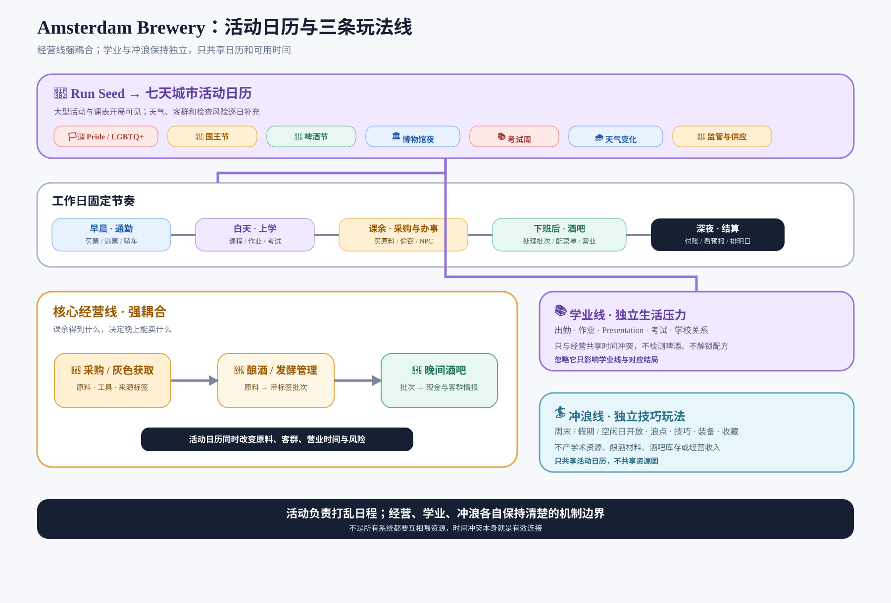
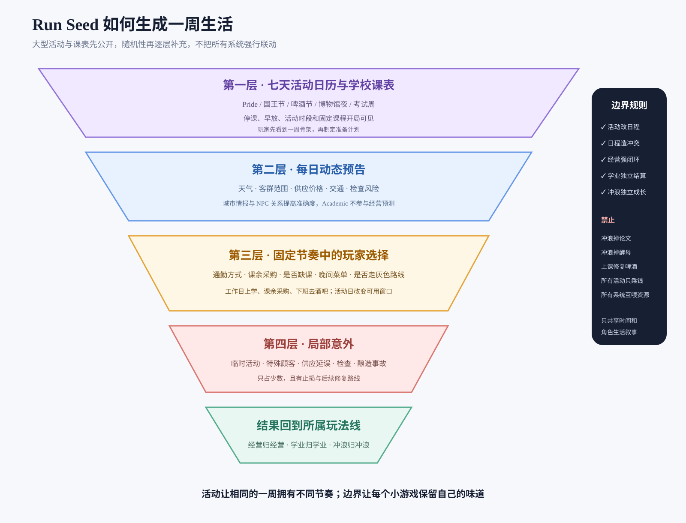
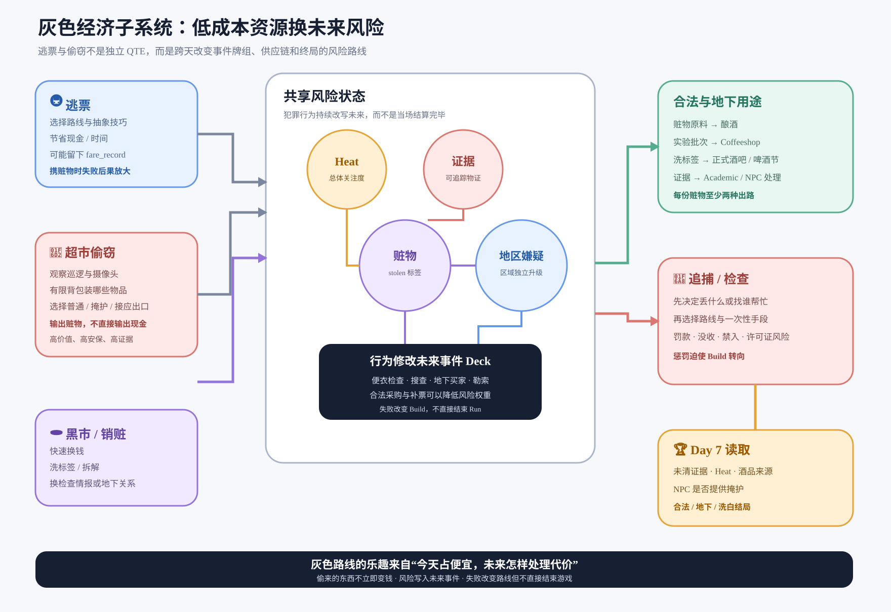

# Amsterdam Brewery 肉鸽机制与数据流设计

> 肉鸽的可能性不是“随机事件数量”，而是 Run Seed 生成一张城市活动日历，玩家在固定的学生生活节奏中应对每天不同的客群、供应和风险。核心经营线是“课余采购与酿酒 → 下班后酒吧兑现”；上学是工作日义务，冲浪是独立的个人爱好线，不与学术、配方或酒吧资源硬连接。核心经济产物应有多种用途，但不是所有小游戏都必须互相耦合。

## 一、可能性应该怎么增长

### 不是横向增加系统，而是纵向增加交叉反应

当前原型的扩展方式更接近：新增一个小游戏、新增一套货币、新增一组升级。这样会增加内容数量，却不会等比例增加策略，因为系统彼此可以独立运行。

更有效的增长方式是：

```text
世界状态
  × 原料标签
  × 工艺选择
  × 城市事件
  × 顾客需求
  × 玩家 build
  = 本局独特问题与解决方式
```

例如只使用：

- 6 种基础酒型；
- 10 种原料特性；
- 6 种工艺结果；
- 8 种城市环境；
- 6 类顾客组合；
- 3 条 build；

理论上已经能产生数万种组合。玩家不需要在一个界面同时理解这些组合，只需要每次面对 2—4 个清晰选项。

### “有效可能性”的四个判断标准

1. **可读：** 玩家知道随机因素是什么，或至少知道它可能带来什么类型的风险。
2. **可控：** 玩家有改变概率、规避风险、提前准备或接受代价的工具。
3. **可传递：** 当前小游戏的结果会改变后续小游戏，而不是只结算一笔钱。
4. **可复述：** 玩家能说出“这局因为暴雨、野生酵母和游客潮，我做了一批高风险酸啤，最后靠酒吧活动卖光了”。



[查看完整数据流图](diagrams/gameplay-dataflow.svg)

---

### 系统耦合边界

- 核心经营线需要紧密流转：采购 → 酿酒 → 库存 → 酒吧 → 现金。
- 城市活动作为环境层，统一影响课表、交通、供应和酒吧客流。
- 学术是一条固定生活压力线，影响学业状态、时间和剧情，不负责检测啤酒或解锁配方。
- 冲浪是一条独立娱乐/技巧线，不产出学术资源、酿酒材料或酒吧收益。
- 灰色经济可以影响现金、采购成本和检查风险，但不是所有系统的万能连接器。

## 二、全局数据模型

### 1. Run 世界状态

每个 Seed 首先生成一张“城市活动日历”，再叠加天气、学校和监管状态。活动是 Run Seed 最重要的内容，不是普通的临时 Buff。

| 状态 | 示例 | 改变什么 |
|-|-|-|
| 城市活动日历 | Pride/LGBTQ+ 节庆、国王节、啤酒节、博物馆夜、运河活动、足球赛 | 哪几天停课/早放、交通、客群、采购机会和酒吧需求 |
| 学校日历 | 正常上课、考试周、Presentation、Group Project、假期 | 工作日强制安排、课余时间、学业压力和缺课后果 |
| 城市气候 | 多雨、热浪、海风周 | 通勤、到店客流和冲浪是否开放 |
| 消费趋势 | 游客潮、当地人周、节庆周 | 需求标签、价格弹性、酒吧客流 |
| 监管强度 | 宽松、检查周、许可证危机 | 地下交易、实验酒、SmartShop 风险 |
| 供应环境 | 酒花短缺、谷物丰收、野生酵母季 | 原料价格和可用标签 |
| 第七天挑战 | 啤酒节、审查、竞争酒吧、债务到期 | 本局最终需要构建什么能力 |

Run 开始时直接展示七天活动日历与课表。大型公开活动全部可见，小型临时活动、天气变化和检查只显示部分预报。例如夏季主题周可以预告周四 Pride 活动和周二上午课程，但不会同时塞入只发生在春季的国王节；玩家仍不知道活动当天会出现哪种特殊顾客。

Run Seed 不直接决定玩家“遇到什么结果”，而是生成一套会持续七天的规则修正器：

```text
RunSeed
  ├─ MajorEvents[]       大型公开活动，开局可见
  ├─ SchoolSchedule[]    固定课程、考试与放假安排，开局可见
  ├─ DailyForecast[]     天气、浪况、交通、客群与检查的逐日预报
  ├─ SupplyPool          本局原料、商品和灰色渠道的供给池
  └─ FinalChallenge      第七天经营结算题目
```

MVP 中每个七日 Seed 建议先选择一个季节主题周，再生成 **1 个终局活动 + 1 个符合季节的大型城市活动 + 2—3 个小型活动**。活动之间允许重叠，但必须通过时间、地点或客群产生组合结果。例如“课程展示 + Pride 活动”意味着白天准备时间缩短、晚上客流暴涨；它制造的是生活冲突，不是给学业线增加酿酒能力。

### 活动不是简单收入倍率

每个大型活动至少改变四个维度：

1. **时间表：** 停课、早放、酒吧延长营业、交通中断；
2. **客群 Deck：** Pride 游客、橙色派对客、博物馆夜学生等；
3. **需求标签：** 彩色、低酒精、派对、大批量、纪念款等；
4. **城市机会：** 限定采购、临时摊位、活动任务和 NPC 出现位置。

活动示例：

| 活动 | 日程变化 | 酒吧需求 | 城市机会 | 主要风险 |
|-|-|-|-|-|
| Pride/LGBTQ+ 节庆 | 下午课程可能缩短，夜间延长营业 | 彩色、果香、低酒精、分享装 | 限定装饰、活动联名、游客潮 | 库存耗尽、拥堵、检查增加 |
| 国王节 | 停课或全天节庆 | 橙色、派对、大批量、便携 | 跳蚤市场采购、街头订单 | 交通瘫痪、价格波动、醉客 |
| 博物馆夜 | 正常上课，夜间特殊客群 | 限量、故事性、学术主题包装 | 学生志愿者、文化联名 | 营业时间冲突、备货不足 |
| 啤酒节 | 可能占用周末整天 | 高品质、评审标签、供货量 | 比赛、批发订单、品牌曝光 | 品质与库存同时受检验 |
| 考试周 | 上课与复习占用更多时间 | 学生客、低价、咖啡类需求 | 校园采购、同学帮助 | 缺课、疲劳、酒吧准备不足 |

### 工作日与节假日日程

工作日不是三个完全自由的行动槽，而是有生活身份约束：

| 时间 | 工作日默认安排 | 玩家可做的选择 |
|-|-|-|
| 早晨 | 通勤上学 | 买票、逃票、骑车；顺路取货或错过第一节课 |
| 上课时间 | 强制课程/作业/小组项目 | 认真完成、最低限度应付、缺课去办事 |
| 午休/课间 | 短课余窗口 | 小额采购、见同学/NPC、查看活动情报 |
| 放学后 | 主要采购与个人事务窗口 | 买原料、偷窃、维修、处理赃物、短暂休息 |
| 晚上 | 酒吧工作 | 配菜单、营业、处理特殊顾客和活动客流 |
| 深夜 | 打烊与计划 | 盘点、付账、查看明后天活动与天气 |

周末、停课日和城市大型活动会打破这张固定表：可能释放白天完整行动，也可能要求玩家提前到酒吧备货、参与活动摊位或应对交通中断。活动改变日程结构，而不仅是收益倍率。

### 每日行动由日程生成，不由统一行动点生成

每天开始时按固定顺序生成可用行动：

```text
学校课表提供强制时间块
  → 城市活动覆盖或移动部分时间块
  → 交通状态决定通勤成本与可达地点
  → 剩余空窗生成采购、偷窃、见 NPC、维修等城市行动
  → 晚间固定进入酒吧经营
  → 深夜只允许盘点、付账和查看预报
```

- **工作日：** 主节奏固定为“上学 → 课余采购/办事 → 下班去酒吧”。
- **周末/假期：** 才可能出现完整自由白天，可用于集中采购、特殊活动或冲浪。
- **节庆日：** 通过 `ScheduleOverride` 改写日程，例如停课、早放、交通封锁、提前开店或延长营业。
- **行动资格：** 每个小游戏声明自己允许进入的时间窗。超市采购/偷窃可进入课间与放学后；酒吧只在晚间；冲浪只在周末、假期、停课日或明确释放的长空窗。

因此玩家的核心决策不是“今天玩哪个小游戏”，而是“在生活日程留下的有限窗口里，哪件事最值得做”。

### 冲浪只共享日历，不共享资源

冲浪系统只读取以下输入：

```text
CanSurf = 有完整自由时段 && 当日浪况允许 && 玩家主动选择去海边
```

它不会读取课程知识、论文进度、酿酒配方、酒吧客群或库存，也不会向这些系统写回任何资源。城市节庆最多通过占用时间、关闭交通或开放海边活动影响“能不能去冲浪”，不能让冲浪掉落论文、酵母、酒花或经营 Buff。冲浪的技巧、装备、照片、收藏和失败惩罚全部在冲浪线内部结算。

### 2. 核心状态资源

全局只保留真正参与决策的资源：

```text
时间：工作日以课表为骨架；上课固定占用时段，课间/放学后可采购和办事，下班后进入酒吧
课业状态：出勤、作业、考试准备与课程压力
现金：购买原料、维修、支付固定成本
原料：麦芽、酒花、酵母、添加物，均带标签
批次：正在发酵或已完成的酒，带品质、风味和缺陷
库存：酒吧可销售的具体批次
需求情报：今晚或未来的顾客偏好与数量范围
关系：NPC 提供规则修改、独家资源或风险保护
Heat：非法交易、实验添加物和违规经营带来的检查风险
设备状态：决定容错、容量和事故概率
```

声望、心情、Meta 等如果继续存在，也必须能明确修改上述资源，不能只作为独立数字。

### 3. 批次是整个游戏最重要的数据包

每一桶酒都应成为可追踪对象，而不是库存栏里的一个数字：

```json
{
  "recipe": "canal_ipa",
  "volume": 4,
  "quality": 72,
  "flavorTags": ["fruity", "bitter"],
  "processTag": "dry_hopped",
  "riskTag": "unstable",
  "storyTag": "local",
  "readyAt": "day_2_evening",
  "shelfLife": 3
}
```

约束建议：

- 每批最多 3 个主要风味标签、1 个工艺标签、1 个风险标签、1 个故事标签。
- 标签数量必须少而稳定，避免词条无限膨胀。
- 顾客、事件、NPC、升级和终局都只与这些标签发生反应。
- 玩家可以给批次命名，使系统组合变成个人故事。

### 推荐的标签池

| 类别 | 标签示例 |
|-|-|
| 风味 | `bitter`、`fruity`、`sour`、`smoky`、`sweet`、`herbal`、`funky` |
| 工艺 | `fresh`、`aged`、`dry_hopped`、`barrel`、`blended`、`limited` |
| 风险 | `unstable`、`contaminated`、`overproof`、`unlicensed` |
| 故事 | `local`、`experimental`、`festival`、`pride`、`kings_day`、`sustainable`、`underground` |

---

## 三、随机性分层

### 第一层：Run Seed，决定宏观题目

整局固定，不应通过重载改变：七天活动日历、学校课表、终局挑战、供应池、NPC 诉求和基础事件牌组。

### 第二层：三日预报，提供计划空间

七天大型活动和课表开局全部公开；每天打烊后再公开未来 2—3 天的天气、客群范围、供应变化和检查风险。预报准确度通过城市情报、NPC 关系或合法付费渠道提高，不与学术小游戏绑定。

### 第三层：Draft 随机，玩家三选一

供应商、NPC 请求、升级、城市行动和特殊配方都优先使用“三选一”，让随机产生选择，而不是直接决定结果。

### 第四层：受控风险，玩家主动下注

野生酵母、地下交易、延长发酵、逃票和偷窃等高收益行为，由玩家主动选择承担风险。冲浪的风险只服务冲浪本身，不进入学术或经营资源链。禁止在玩家完全无信息时随机摧毁核心资产。

### 第五层：意外事件，负责制造故事

真正不可预测的惊喜只占约 10%—15%，用于产生记忆点，且应提供补偿或后续修复机会。

### 随机性合同

- 每个负面结果至少存在一种预防、缓解或事后利用方式。
- 连续两次同类坏事件进入保底或事件池冷却。
- 关键失败不由一次不可见骰子决定。
- 玩家可以支付资源查看更多信息、锁定一个结果或重抽一次。
- RNG 改变问题，不替玩家作决定。



[查看完整随机性图](diagrams/run-randomness.svg)

---

## 四、每个小游戏应该承担什么职责

### 1. 酿酒：核心转换引擎

**唯一职责：** 把带标签的原料和玩家操作转换为带标签的批次。酿酒不直接产钱。

#### 输入

- 基础酒型；
- 2—3 种原料批次；
- 设备状态；
- 天气与室温；
- 玩家已掌握的配方知识；
- 当前订单或未来需求预测。

#### 三段玩法

1. **配方 Draft：** 从可用原料中选择搭配，界面预览可能产生的风味范围。
2. **工艺路线：** 糖化、煮沸、发酵各出现 2 个路径，不是只按时间点。例如“稳妥低温”与“高温抢香”。
3. **事故决策：** 出现偏差时选择救质量、保产量、延长时间或改造成另一种酒。

#### 随机性

- 原料存在公开标签和一个隐藏次级特性；
- 发酵中从与当前标签有关的事故牌组抽取；
- 设备、天气和关系修改事故权重；
- 玩家通过配方笔记、酿酒设备、供应商说明或酒吧试饮逐渐识别隐藏特性；Academic 不参与酿酒公式。

#### 输出

- 具体批次数量；
- 品质；
- 风味、工艺、风险、故事标签；
- 完成时间与保质期；
- 一段可用于命名和分享的批次故事。

#### 可能性示例

`citrus_hop + wild_yeast + heat_wave + high_temp_ferment`

可能产出：`fruity + funky + unstable + experimental`。游客可能喜欢，传统常客可能讨厌；玩家可以延长发酵、与稳定批次混调、交给 SmartShop 继续突变，或在酒吧高价冒险售卖。

### 2. 酒吧：库存兑现与市场学习引擎

**唯一职责：** 把批次转换为现金、关系、评价和未来需求情报。

#### 输入

- 玩家选择的 3 个菜单位；
- 每批库存和标签；
- 当晚顾客牌组；
- 街区、天气、事件和声望；
- 定价、宣传和 NPC 支援。

#### 玩法结构

1. 开店前选择菜单、价格、限量策略和保留库存。
2. 顾客以“需求卡”出现，展示偏好、预算、耐心和隐藏动机。
3. 玩家选择推荐哪批酒、是否降价、是否拒绝、是否使用关系能力。
4. 连续满足同一客群会形成口碑，但也可能让菜单过度单一。

#### 随机性

- 顾客不是独立随机，而是从“今晚顾客 Deck”抽取；Deck 组成受城市状态影响。
- 酒吧营业前给出模糊预报，如“游客较多”“本地常客可能来”。
- 特殊顾客和事故只插入少量 Surprise 卡。

#### 输出

- 现金；
- 剩余库存与损耗；
- 常客、评价、街区声望；
- 哪些标签卖得好或差的需求数据；
- NPC 线索、检查风险和新订单。

#### 有趣点

同一批 `fruity + unstable` 的酒，可以：

- 高价卖给追新游客；
- 低价清仓给派对客；
- 保留给啤酒节；
- 送给 NPC 换关系；
- 与稳定批次混调降低风险；
- 转入 Coffee/SmartShop 做混合产品。

### 3. Coffee/Coffeeshop：现金流与 Heat 套利引擎

**唯一职责：** 提供高流动性、高风险的应急渠道，并产生街头需求情报。它不应该只是第二个酒吧。

#### 输入

- 现金压力；
- 实验批次、次品酒或特殊添加物；
- 当前 Heat；
- 街区情报和地下联系人。

#### 玩法结构

- 每位顾客给出价格区间、可疑程度和需求标签。
- 玩家决定正常售卖、搭售实验品、拒绝或隐藏库存。
- 连续追求高利润会提高 Heat，并向事件 Deck 塞入卧底、检查和竞争者。
- 保守经营可降低 Heat，并获取稳定现金与需求传闻。

#### 输出

- 快速现金；
- Heat；
- 地下联系人；
- 明日顾客 Deck 的部分信息；
- 黑市订单和稀有材料入口。

#### 关键取舍

它可以救活一个资金断裂的 Run，但会让第七天许可证检查更难。

### 4. Surfing：独立的个人技巧与放松线

**唯一职责：** 提供与学习、酿酒和酒吧经营分离的操作型娱乐。它代表角色的个人生活与玩家纯技巧成长，不负责产出学术资源、酿酒材料、酒吧库存或经营收入。

#### 输入

- 周末、假期、停课日或玩家主动腾出的自由时段；
- 天气与浪况预报；
- 冲浪体力和冲浪装备；
- 玩家选择的海域深度。

#### 玩法结构

1. 先选择安全岸边、中层浪区或危险深水。
2. 玩家通过节奏/方向操作保持平衡并拾取漂流物。
3. 每获取一件资源都可以立即返航，或继续深入提高倍率。
4. 落水会结束本次挑战，影响本次分数和冲浪状态，但不惩罚学术或酒吧数据。

#### 随机性

- 浪型可预报，技巧挑战和收藏目标按 Seed 变化；
- 天气和装备改变事故概率；
- 连续深入会提高分数倍率和稀有收藏出现率，也提高本次落水概率。

#### 输出

- 冲浪分数、段位和技巧熟练度；
- 冲浪板外观、服装、照片和收藏；
- 独立冲浪挑战与个人成就；
- 可选的心情展示，但不直接修改经营收益。

#### 隔离边界

- 不产生 Academic 研究材料、论文、Focus 或课程加成；
- 不产生酿酒原料、酒吧库存或现金；
- 不解锁配方，也不成为终局啤酒节的必要条件；
- 只共享日历和可用时间：工作日通常没有冲浪时间，周末、假期和特殊天气才开放；
- 冲浪失败只影响本次冲浪奖励，不惩罚第二天上课或酒吧经营。

### 5. Academic/Class：工作日主线义务

**唯一职责：** 表达留学生身份与工作日压力。上学不是玩家可随意跳过的资源工具，也不负责检测啤酒、稳定批次或预测酒吧市场。

#### 输入

- 当日课程、作业、Presentation 或考试；
- 出勤、精力和课程准备；
- 同学、导师和小组关系；
- 活动日历造成的调课、停课与截止日期变化。

#### 玩法结构

- 普通上课以短决策和时间安排为主，不必每天重复完整小游戏；
- 考试、Presentation、Group Project 等关键节点才进入具体小游戏；
- 玩家在认真准备、临时应付、请同学帮忙或缺课打工之间作选择；
- 缺课和拖延会累积学业压力，影响学校结局和相关人物关系，但不改变酒的品质公式。

#### 输出

- 出勤、成绩与学业压力；
- 导师和同学关系；
- 奖学金、补考、延期或毕业结局；
- 特定日程变化，例如考试前减少课余采购时间；
- 独立的课程知识、论文和个人成长内容。

#### 有趣点

玩家面对的是学生与兼职工作的生活冲突：明天要 Presentation，今晚酒吧又缺人；缺课能多赚一次营业收入，但会让考试周更危险。学术线与经营线共享的是时间冲突和人物生活，不共享配方与资源公式。

### 6. SmartShop：高方差突变与合成引擎

**唯一职责：** 用 Heat 和不确定性换取违反常规的标签组合。

#### 输入

- 普通原料或酒批次；
- 菌株、添加物；
- Heat 和关系；
- 玩家愿意承担的污染概率。

#### 玩法结构

- 选择培养方向：稳定、产量或突变。
- 温度、湿度、光照不是三个独立数值小游戏，而是三个互斥资源旋钮；调高一项会挤压另一项。
- 每阶段出现一次“提前收获 / 继续培养 / 添加催化物”的 push-your-luck 选择。
- 突变结果从与输入标签关联的表中产生，不是完全随机。

#### 输出

- 稀有添加物；
- 将普通标签转换成特殊标签；
- 污染、违法或成瘾等风险标签；
- 黑市 NPC、特殊顾客和检查事件。

#### 示例

`herbal + wild_yeast` 可能转化成 `psychedelic` 或 `medicinal`，前者吸引地下客群并增加 Heat，后者能完成特定 NPC 或地下订单。Academic 不消费这类产物。

### 7. 城市移动：机会 Draft，不做步行模拟

**唯一职责：** 在课表与下班时间之间，为有限的课余时间提供机会选择。

- 工作日课程开始前、午休和放学后显示 2—4 个短行动节点；晚上默认去酒吧工作。
- 周末和大型活动日才开放较长的自由行动块。
- 节点公开收益类型、时间成本和主要风险，但保留一个未知结果。
- 骑车、天气和关系改变可达节点，而不是只改变移动速度。
- 玩家进入地点即消耗对应课余时间，避免在一段休息时间内把所有事情做完。

### 8. NPC：修改规则，不只发钱和播对话

每个核心 NPC 必须拥有属于其生活线的作用，但不要求所有 NPC 都连接经营系统：

- 一种独家机会或帮助；
- 一种所属系统内的规则修改；
- 一个会与其他 NPC 冲突的诉求；
- 一条可以在第七天兑现的关系结果。

示例：

- Erik：增加酒吧常客，但要求菜单稳定。
- Chen：影响课程、作业和学校结局，不参与啤酒配方与批次稳定。
- Sofie：提供花香原料与游客渠道，但会提高成本。

玩家无法同时满足所有人，关系才会变成 build。

### 9. 第七天啤酒节：整局 Build 检查器

终局应读取整局所有主要数据：

- 酒品质量与标签匹配评委偏好；
- 库存量满足销售波次；
- 顾客声望决定开局客流；
- NPC 关系提供一次支援；
- Heat 决定是否触发检查；
- 现金决定是否支付最终账单；
- 玩家选择的主打酒决定结局和跨局解锁。

终局不是另一个完全独立的小游戏，而是前六天数据的统一消费端。

---

## 五、系统之间的交叉连接

| 产物 | 用途 A | 用途 B | 用途 C |
| --- | --- | --- | --- |
| 次品酒 | 酒吧低价清仓 | 与稳定批次混调 | Coffeeshop 地下混合 |
| 高品质限量酒 | 高价销售 | 啤酒节保留 | NPC 礼物/合约 |
| 需求情报 | 调整下一批配方 | 改变酒吧菜单 | 卖给竞争者换现金 |
| 稀有酵母 | 直接酿酒 | 供应商鉴定后写入配方本 | SmartShop 突变 |
| Heat | 提高地下利润 | 增加检查概率 | 触发特殊 NPC 与结局 |
| 关系 | 独家资源 | 一次事件反制 | 终局支援 |

### 系统设计门禁

以后新增任何核心经营机制，必须回答：

1. 它消费什么已有数据？
2. 它产生什么可被其他经营系统消费的数据？
3. 玩家为使用它放弃什么？
4. 它如何改变至少一种 build？
5. 玩家如何提前感知风险？

对于 Academic 与 Surfing 这类明确隔离的生活线，改用另一组门禁：

1. 它自身的操作是否足够有趣？
2. 它是否只共享时间与叙事，而不污染经营资源图？
3. 玩家忽略它时，代价是否只发生在对应生活线？
4. 它是否提供独立进度、结局或收藏，而不是伪装成经营增益？

回答不了，就不应进入游戏。

---

## 六、示例 Run：一次随机如何产生完整故事

### Seed 生成

- 城市周：连续降雨；
- 周日挑战：游客啤酒节；
- 监管：中度检查；
- 供应：柑橘酒花便宜，传统麦芽短缺；
- NPC：Chen 想要一批实验酒，Erik 要求保持常客菜单。

### Day 1

玩家上午上课，午休看到国王节前柑橘酒花促销；放学后买入柑橘酒花和便宜野生酵母，选择高温发酵，得到 `fruity + funky + unstable` 批次。此时有三个经营方向：

- 延长到第二天再发酵，牺牲明晚的可售库存；
- 去 SmartShop 继续突变，追求特殊标签但增加 Heat；
- 直接晚上出售，利用游客对新奇风味的偏好。

### Day 2—4

玩家选择直接售卖，获得高收入但差评提高；雨天让游客集中到室内，酒吧客流增加。Erik 因菜单过于实验而降低关系。学校同时进入 Group Project 周，玩家必须在放学后开组会和采购原料之间取舍。玩家决定把下一批做成稳定 Lager，形成“实验主打 + 稳定走量”的混合 build。

### Day 5—6

检查预告出现。玩家可以：

- 支付现金降低 Heat；
- 找 Erik 用关系处理许可证；
- 继续冒险生产实验酒，为啤酒节冲高分。

### Day 7

啤酒节评委偏好 `fruity` 和 `local`，游客偏好 `experimental`，检查员惩罚 `unstable`。玩家必须决定把有限的酒分给评委、游客还是保留证据处理检查。

这条故事不需要专门写一整段剧情，而是由同一批次的数据在多个系统中不断被读取和改变。

---

## 七、MVP 应先实现的可能性规模

### 第一阶段只做

- 3 个基础酒型；
- 8 种原料，每种 1 个公开标签 + 1 个隐藏标签；
- 10 个顾客原型；
- 8 个有预告、有选择的城市事件；
- 3 个 NPC；
- 2 条 build；
- 一套工作日课表和 2 个关键学业节点；
- 3 类大型活动模板：Pride/LGBTQ+ 节庆、国王节、啤酒节；
- 1 个第七天啤酒节终局。

暂不开放 Coffee 与 SmartShop 的完整版本。可以先把它们做成单次城市事件卡，验证它们提供的数据是否真的改变酿酒与酒吧。Surfing 可以保留成独立玩法原型，但不作为经营 MVP 的完成条件，也不连接 Academic 或酒吧资源。

### 验证通过后再扩

1. 先完善活动日历与工作日课表，让每个 Run 的时间结构不同。
2. 再加入 Coffeeshop，增加现金流与 Heat 路线。
3. 再加入 SmartShop，增加高方差突变 build。
4. Surfing 独立扩展自己的浪点、技巧、收藏与挑战，不进入上述经营扩展顺序。

每加入一个经营小游戏，都必须让现有批次、事件和顾客产生新的用法，而不是只增加自己的独立货币和升级树。独立生活小游戏则必须保持边界，只共享日历与角色叙事。

## 八、最终设计原则

**可能性不是玩家能点多少按钮，而是同一个选择能在多久之后、以多少种方式重新回来影响玩家。**

这个项目最适合形成的肉鸽结构是：

```text
Seed 提出本周题目
→ 玩家读取预告并制定计划
→ 小游戏转换带标签的数据
→ 下游系统读取并重新定价这些数据
→ 城市事件迫使玩家改变计划
→ 第七天统一检验 Build
→ 跨局只保留知识与新规则，不直接消灭风险
```

如果按这个结构落地，即使只有酿酒、酒吧、研究三个小游戏，也会比六个互相独立的小游戏拥有更多有效可能性。

---

## 九、灰色经济子系统：逃票、超市偷窃、黑市与追捕

逃票和偷窃可以加入，但不能设计成“按准了就免费获得资源”的独立小游戏。它们应该组成一条贯穿整个 Run 的高风险资源路线：玩家用 Heat、证据、关系和未来行动自由，换取眼前的现金、原料与移动效率。

### 共享数据

```text
Heat：城市对玩家的总体关注度，影响巡查和检查牌权重
地区嫌疑：每个街区独立累积，决定该区域摄像头、店员和便衣强度
证据：具体可追踪物，例如录像、未消磁标签、逃票记录
赃物：带 stolen 标签的真实物品，不能直接等同现金
藏匿点：玩家可以把证据或赃物暂存，但可能被搜索
地下关系：提供销赃、洗标签、伪装与一次性保护
通缉状态：短期规则修改，例如特定区域不可进入、票价检查升级
```

建议不要再增加独立“犯罪等级”。Heat 负责整体危险，证据负责具体追责，地下关系负责玩家控制手段，已经足够形成闭环。



[查看完整灰色经济图](diagrams/grey-economy.svg)

### 1. 逃票：移动资源的风险下注

**唯一职责：** 让玩家在现金、时间与 Heat 之间取舍，并改变城市行动范围。

#### 输入

- 当前现金与行动时段；
- 路线距离和换乘次数；
- 车站检查预报；
- 已掌握的逃票技巧；
- 当前 Heat、证据和 NPC 关系；
- 身上是否携带赃物或非法批次。

#### 开始前的路线选择

| 路线 | 成本 | 时间 | 检查风险 | 特点 |
|-|-|-|-|-|
| 正常买票 | 高 | 低 | 无 | 稳定，降低少量 Heat |
| 混合路线 | 中 | 中 | 低 | 一段买票、一段冒险 |
| 全程逃票 | 低 | 低 | 高 | 节省现金，但失败后果随携带物放大 |
| 步行/骑车 | 无 | 高或占行动 | 无 | 受天气、装备与地区影响 |

#### 三阶段小游戏

1. **读站：** 显示检票员类型、拥挤度和几个可选站台。信息可能不完整。
2. **选策略：** 从已解锁技巧中选择一个抽象策略卡，例如“混入人群”“临时票据”“换线拖延”“关系掩护”。每种只克制部分检查类型。
3. **执行与止损：** 在几个公开窗口中选择上车、等待或放弃。如果发现预判错误，可以补票止损，但会损失时间和部分现金。

#### 结果不只成功/失败

- **干净通过：** 节省车费，不增加证据；
- **可疑通过：** 节省车费，但留下 `fare_record` 证据或提高地区嫌疑；
- **补票止损：** 支付更高票价，但避免被搜查；
- **被拦截：** 罚款、损失时段，并检查随身赃物；
- **成功转移注意：** 保护身上的赃物，但某 NPC 或地区关系下降。

#### 跨系统可能性

- 携带 `stolen` 原料逃票失败时，惩罚从普通罚款升级为没收和市场禁入；
- 高 Heat 时，车站检查 Deck 加入便衣与随机搜查；
- NPC 教授的技巧不再只是提高固定成功率，而是克制一种检查类型；
- 骑车升级提供合法替代，但雨天或车辆故障会降低可用性；
- 连续干净逃票形成“通勤路线知识”，让特定线路的预报更准确。

### 2. 超市偷窃：有限背包的目标选择

**唯一职责：** 用嫌疑和证据换取低成本原料、工具与特殊任务物品。偷窃成功只获得赃物，不直接获得现金。

#### 输入

- 本周供应短缺和原料价格；
- 当前酒单与未来顾客需求；
- 背包容量；
- 商店布局、摄像头盲区、店员巡逻与出口；
- 地区嫌疑、Heat、伪装和地下关系。

#### 物品属性

```text
价值：合法购买价或黑市价值
体积：占用背包格
安保：被发现与留下证据的权重
新鲜度：跨天衰减
标签：麦芽、香料、糖、清洁剂、礼物、工具等
来源：合法 / stolen / laundered
```

#### 三阶段小游戏

1. **观察：** 商店短暂展示店员路线、摄像头扇区和今日促销；玩家选择先观察更多还是立即行动。观察消耗时间，但减少未知。
2. **装包：** 在有限容量中选择物品。每件物品增加潜在收益与嫌疑，形成背包式组合问题，而不是按三次 Space。
3. **离场：** 选择普通出口、自助结账掩护或地下联系人接应。路线与背包内容共同决定事件 Deck。

#### 动态风险

- 偷高安保物品会加入“未消磁标签”证据；
- 同一商店连续作案提高地区嫌疑，改变后续布局；
- 大量低价值物品更占容量但不容易触发严重检查；
- 带走与当前短缺相关的原料利润高，但安保也会升级；
- 玩家可以放弃部分赃物降低嫌疑，或栽赃给竞争者换取短期安全与长期敌对。

#### 输出和用途

- `stolen` 原料：可直接酿酒，但产生 `unlicensed` 或 `underground` 故事标签；
- 工具：临时维修设备，可能在检查时成为证据；
- 礼物：送 NPC 时存在被识破风险；
- 清洁剂：可降低污染风险，也可清除部分物证；
- 高价值商品：必须通过地下渠道销赃，不能立即变现金。

### 3. 黑市/销赃：把犯罪收益转换成可用价值

**唯一职责：** 消费赃物、证据和地下关系，为犯罪路线提供真正的兑现端。

#### 玩家选择

- **快速销赃：** 立即获得少量现金，Heat 上升；
- **洗标签：** 花时间和关系把 `stolen` 转成 `laundered`，可用于正式酒吧或啤酒节；
- **拆解：** 将工具或商品转换成普通原料，价值下降但证据减少；
- **交换情报：** 不拿现金，换取检查预报、稀有供应或 NPC 秘密；
- **保留赃物：** 等待高价订单，但承担藏匿点被搜查的风险。

黑市可以依附酒吧后门或 Coffeeshop，不必再做一个大地图建筑。

### 4. 追捕/逃脱：所有灰色行为的风险结算器

**唯一职责：** 当证据与 Heat 达到阈值时，对玩家之前的风险选择进行结算，而不是随机插入一个 QTE。

#### 触发来源

- 逃票被识别；
- 超市报警；
- 酒吧出售 `unlicensed` 批次；
- Coffeeshop Heat 过高；
- 藏匿点被搜索；
- NPC 背叛或竞争者举报。

#### 三阶段结构

1. **弃什么：** 丢赃物、销毁证据、支付现金或让 NPC 承担关系代价；
2. **走哪条路：** 根据已知地图和地区嫌疑选择路线，不同路线消耗时间、体力或关系；
3. **用什么手段：** 消耗一次性技巧、伪装、关系或装备解决最后检查。

#### 失败层级

- 轻度：罚款、损失一个时段；
- 中度：赃物没收、地区禁入一天、关系下降；
- 重度：酒吧检查升级、许可证风险、终局扣分；
- 极端：不会直接结束 Run，而是强迫玩家转成合法低利润路线或偿还处罚。

失败应该改变 Build，而不是简单扣钱后继续原计划。

### 5. 灰色路线与合法路线应互相制衡

| 路线 | 优势 | 代价 | 适合 Build |
|-|-|-|-|
| 全合法 | 稳定、终局安全 | 原料贵、扩张慢 | 社区酒馆、品质路线 |
| 机会主义 | 缺货时偶尔偷窃或逃票 | 少量 Heat，需要止损 | 灵活混合路线 |
| 地下网络 | 低成本原料、特殊标签、高爆发 | 高 Heat、证据、关系冲突 | 实验酒、派对供应商 |
| 洗白路线 | 前期犯罪积累，后期清证据转合法 | 消耗大量时间和关系 | 高难度翻盘 Build |

### 6. 事件牌组如何被犯罪行为修改

玩家的行为不只改变一个数值，而是向未来事件 Deck 添加或删除卡牌：

```text
连续逃票
→ 加入：便衣检查、线路封锁、逃票同伴
→ 移除：普通无事发生

高价值偷窃
→ 加入：超市悬赏、地下买家、竞争者勒索
→ 提高：地区搜查权重

成功洗标签
→ 移除：对应物品证据
→ 加入：地下联系人索要回报

主动补票或合法采购
→ 降低：Heat 与检查权重
→ 增加：现金压力和债务事件权重
```

这样犯罪行为会改变未来可能性空间，而不是只触发一次成功或失败。

### 7. 第七天终局如何读取灰色路线

啤酒节/许可证终局同时读取：

- 未清除证据数量；
- 当前 Heat；
- 主打酒是否包含 `stolen`、`laundered`、`unlicensed` 标签；
- 哪些 NPC 愿意作证或提供掩护；
- 玩家是否完成合法供应链；
- 地下客群是否形成足够强的替代市场。

可能出现的结局不是简单好坏：

- 合法精品酒厂；
- 社区英雄酒吧；
- 地下传奇品牌；
- 被迫出售配方偿债；
- 酒吧停牌，但保留地下网络进入下一局新规则。

### 8. 灰色经济的 MVP 范围

第一版建议只做：

- 逃票 3 条路线、4 种抽象技巧、3 类检查员；
- 超市 3 个区域、12 种物品、一个有限背包；
- Heat、地区嫌疑、证据和 `stolen/laundered` 标签；
- 一个黑市销赃界面；
- 一个通用追捕结算器；
- 6 张由犯罪行为动态加入的事件卡；
- 第七天许可证检查对灰色路线的结算。

不建议首版加入多家超市、多条复杂潜行路线、战斗或警察 AI。先验证“偷来的东西是否真实改变酿酒和酒吧选择”，再增加操作深度。

---

## 十、全玩法地图与独立小游戏策划

项目后续按“完整小游戏、轻决策玩法、活动容器”三类组织，避免把每个系统都做成重复 QTE。

### A. 完整小游戏

需要稳定操作循环、失败层级和独立练习价值：

1. 城市路线与通勤；
2. 合法采购与议价；
3. 逃票；
4. 超市偷窃；
5. 追捕与逃脱；
6. 酿酒；
7. 发酵照料与批次抢救；
8. 晚间酒吧服务；
9. Coffeeshop 订单调度；
10. SmartShop 标签合成；
11. 设备维修；
12. 关键学业挑战；
13. 冲浪；
14. 节庆摊位经营；
15. 第七天啤酒节终局。

### B. 轻决策玩法

每次控制在 10—40 秒，作用是连接完整小游戏，不追求单独做成大型关卡：

1. 七日计划与每日排程；
2. 黑市销赃与赃物洗白；
3. 地窖库存与批次分配；
4. 菜单、定价与备货；
5. 深夜盘点、账单和债务处理；
6. 日常上课、作业与出勤选择；
7. NPC 谈判、请求和关系承诺。

### C. 活动容器

Pride/LGBTQ+ 节庆、国王节、博物馆夜、考试周、啤酒节等活动不各自复制一套玩法，而是通过 `ScheduleOverride`、`DemandDeckPatch`、`SupplyPatch`、`TrafficPatch` 和 `RiskPatch` 改写上述小游戏。

所有独立策划统一放在 `小游戏策划/` 目录。每份文档必须回答：核心乐趣、准入时段、输入、操作循环、随机性、成功与失败层级、输出、跨日影响、活动变体、系统边界和 MVP 范围。
